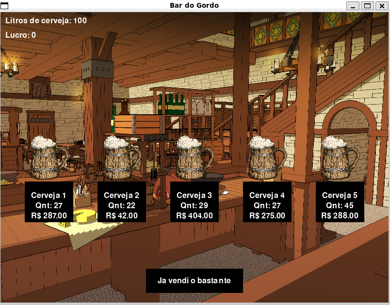
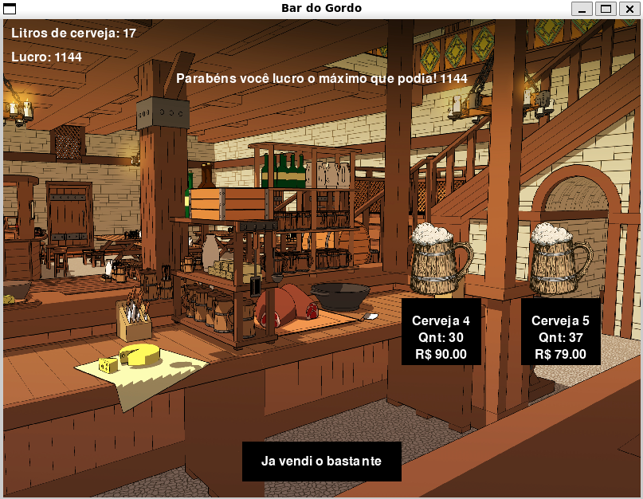

**!! Atenção: Renomeie o seu repositório para (Tema)_(NomeDoProjeto). !!** 

Temas:
 - Grafos1
 - Grafos2
 - PD
 - D&C
 - Greed
 - Final 
 
 **!! *Não coloque os nomes dos alunos no título do repositório*. Exemplo de título correto: Grafos2_Labirinto-do-Minotauro !!**
 
 (Apague essa seção)

# NomedoProjeto

**Número da Lista**: X<br>
**Conteúdo da Disciplina**: XXXXXXXXXX<br>

## Alunos
|Matrícula | Aluno |
| -- | -- |
| xx/xxxxxx  |  xxxx xxxx xxxxx |
| xx/xxxxxx  |  xxxx xxxx xxxxx |

## Sobre 
Descreva os objetivos do seu projeto e como ele funciona. 

## Screenshots





## Instalação 
**Linguagem**: xxxxxx<br>
**Framework**: (caso exista)<br>
Descreva os pré-requisitos para rodar o seu projeto e os comandos necessários.

## Uso 

### Pré-requisitos

Antes de executar o programa, certifique-se de ter o Python 3 instalado em seu sistema. Você pode fazer o download da versão mais recente do Python em python.org.

### Instalação de Requisitos

O programa requer algumas dependências que devem ser instaladas, desta forma siga as etapas abaixo:

1. Abra o terminal e navegue até o diretório do projeto.

2. Execute o seguinte comando para instalar as dependências:

```shell
pip install -r requirements.txt
# Isso garantirá que todas as bibliotecas necessárias sejam instaladas corretamente.
```

### Executando o Programa

Após ter instalado os requisitos, você pode executar o programa seguindo estas etapas:

1. Execute o seguinte comando para iniciar o programa:

```shell
python3 main.py
```

Siga as instruções dadas durante a execução do jogo e se divirta.

## Outros 
Quaisquer outras informações sobre seu projeto podem ser descritas abaixo.


